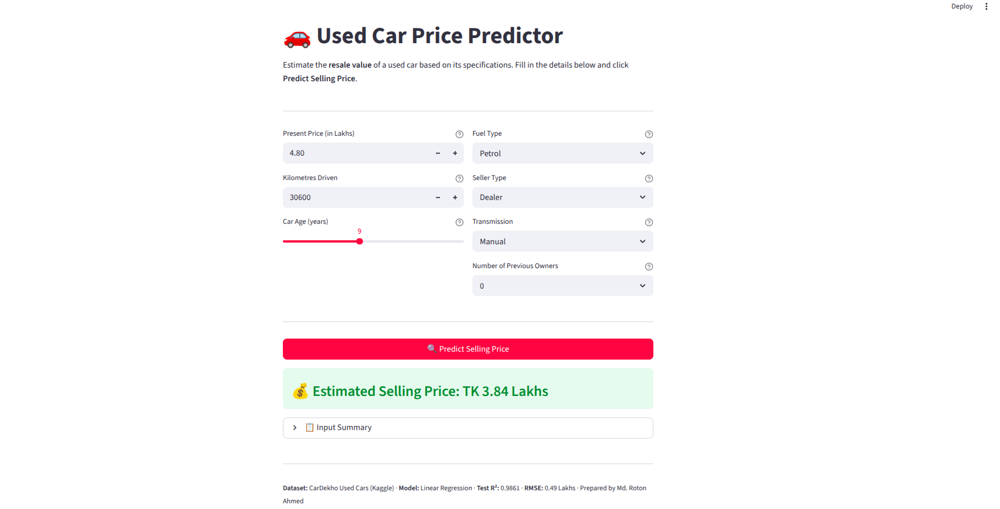

# Used Car Price Prediction

## Overview
An end-to-end machine learning project that predicts the **resale price of used cars** based on vehicle attributes such as present price, kilometres driven, age, fuel type, transmission, and seller type. The project covers exploratory data analysis, feature engineering, training and comparison of five regression models, and deployment as an interactive Streamlit web application.

**Prepared by:** Md. Roton Ahmed

---

## Dataset
- **Source:** [Kaggle — Vehicle Dataset from CarDekho](https://www.kaggle.com/datasets/nehalbirla/vehicle-dataset-from-cardekho)
- **File:** `car_data.csv`
- **Features used:** `Present_Price`, `Kms_Driven`, `Car_Age`, `Fuel_Type`, `Seller_Type`, `Transmission`, `Owner`
- **Target:** `Selling_Price` (in Lakhs TK)
- **Total samples:** 301

---

## Key EDA Findings
- **Present_Price** has the strongest positive correlation with Selling_Price (r ≈ 0.95) — it is the single most important predictor.
- **Diesel cars** command higher resale prices than Petrol or CNG cars, reflecting their fuel-efficiency advantage and higher original sticker prices.
- **Cars older than 10 years** show a sharp drop in resale value — Car_Age (derived from Year) has a strong negative relationship with price.
- **Manual transmission dominates** (~87% of listings), while Automatic cars are fewer but priced higher on average.
- **Kms_Driven** shows a weak negative correlation with Selling_Price and contains outliers that were capped at the 99th percentile during preprocessing.

---

## Model Comparison

| Model             | Train R² | Test R²  | Test RMSE |
|-------------------|----------|----------|-----------|
| Linear Regression | 0.9895   | **0.9861** | **0.4889** |
| Ridge Regression  | 0.9895   | 0.9861   | 0.4889    |
| Random Forest     | 0.9964   | 0.9763   | 0.6402    |
| XGBoost           | 0.9999   | 0.9731   | 0.6811    |
| LightGBM          | 0.9942   | 0.9687   | 0.7346    |

*Sorted by Test R² descending.*

---

## Final Model

**Model:** Linear Regression  
**Test R²:** 0.9861  
**Test RMSE:** 0.4889 Lakhs  

**Why this model:** Linear Regression achieves the highest Test R² with virtually no overfitting (Train–Test gap of only 0.003). The target variable has near-linear relationships with the key numerical predictors (especially `Present_Price` and `Car_Age`), making simpler linear models more appropriate than complex tree ensembles. XGBoost, while achieving near-perfect Train R² (0.9999), overfit significantly (Test R²=0.9731), confirming that model complexity was unnecessary here.

---

## Web Application

Deployed using Streamlit Cloud.

🔗 **Live URL:** [https://your-app-url.streamlit.app](https://your-app-url.streamlit.app)

### Screenshots


---

## Installation

```bash
git clone https://github.com/roton43/used-car-price-prediction.git
cd used-car-price-prediction
pip install -r requirements.txt
```

## Usage

```bash
streamlit run app.py
```

---

## Project Structure

```
used-car-price-prediction/
├── data/
│   └── car_data.csv
├── notebooks/
│   ├── 1_eda.ipynb          # Exploratory Data Analysis
│   └── 2_training.ipynb     # Feature Engineering & Model Training
├── models/
│   └── best_model.pkl       # Saved best model pipeline
├── screenshots/
│   └── streamlit_app.png    # Screenshot of deployed app
├── app.py                   # Streamlit deployment
├── requirements.txt
└── README.md
```

## Technologies Used

- **Python** 3.x
- **Pandas**, **NumPy**, **Matplotlib**, **Seaborn** — data manipulation & EDA
- **Scikit-learn** — preprocessing, Linear Regression, Ridge, Random Forest
- **XGBoost**, **LightGBM** — gradient boosting models
- **Joblib** — model serialisation
- **Streamlit** — web application deployment
